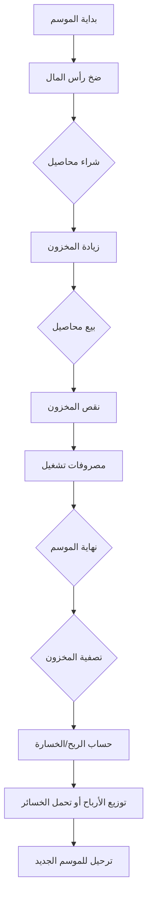

# خريطة تدفق العمليات - نظام المحاسبة الزراعية
# Business Flow Map - Agri Trading System

**التاريخ:** 2026-01-19  
**الغرض:** فهم كامل لدورة حياة الموسم والعلاقات بين جميع الكيانات

---

## 🔄 دورة حياة الموسم الكاملة (Season Lifecycle)



---

## 📊 سيناريو عملي: موسم كامل

### **الوضع الافتتاحي:**
- رأس المال: **1,000,000 ج.م** (في الخزينة)
- المخزون: **صفر**
- الديون علينا: **صفر**
- الديون لنا: **صفر**

---

### **الخطوة 1: ضخ رأس المال (Capital Injection)**

```
┌─────────────────────────────────────────────────────────────┐
│ العملية: إضافة رأس مال 1,000,000 ج.م                        │
├─────────────────────────────────────────────────────────────┤
│ القيد المحاسبي:                                             │
│   مدين: الخزينة (أصل)         1,000,000                    │
│   دائن: رأس المال (ملكية)     1,000,000                    │
├─────────────────────────────────────────────────────────────┤
│ الأرصدة بعد العملية:                                        │
│   • الخزينة = 1,000,000 ج.م ✓                              │
│   • رأس المال = 1,000,000 ج.م ✓                            │
└─────────────────────────────────────────────────────────────┘
```

---

### **الخطوة 2: شراء محصول (Purchase)**

```
┌─────────────────────────────────────────────────────────────┐
│ العملية: شراء 1000 كجم قمح × 20 ج.م = 20,000 ج.م           │
│          من المورد "أحمد" - بالآجل (لم ندفع)                │
├─────────────────────────────────────────────────────────────┤
│ ماذا يحدث في النظام:                                       │
│                                                             │
│ 1️⃣ القيد المحاسبي:                                         │
│    مدين: المخزون (أصل)        20,000                       │
│    دائن: ذمم الموردين (التزام) 20,000                       │
│                                                             │
│ 2️⃣ تحديث المخزون:                                          │
│    + دفعة جديدة: 1000 كجم × 20 ج.م/كجم                     │
│    + متوسط التكلفة = 20 ج.م/كجم                            │
│                                                             │
│ 3️⃣ تحديث رصيد المورد:                                      │
│    المورد "أحمد" = 20,000 ج.م (علينا له)                    │
├─────────────────────────────────────────────────────────────┤
│ الأرصدة:                                                    │
│   • الخزينة = 1,000,000 ج.م                                │
│   • المخزون = 20,000 ج.م (1000 كجم)                       │
│   • ذمم الموردين = 20,000 ج.م (علينا)                      │
└─────────────────────────────────────────────────────────────┘
```

---

### **الخطوة 3: دفع للمورد (Payment)**

```
┌─────────────────────────────────────────────────────────────┐
│ العملية: دفع 15,000 ج.م للمورد "أحمد"                       │
├─────────────────────────────────────────────────────────────┤
│ القيد المحاسبي:                                             │
│   مدين: ذمم الموردين          15,000                       │
│   دائن: الخزينة               15,000                       │
├─────────────────────────────────────────────────────────────┤
│ الأرصدة:                                                    │
│   • الخزينة = 985,000 ج.م                                  │
│   • ذمم الموردين = 5,000 ج.م (باقي لأحمد)                  │
└─────────────────────────────────────────────────────────────┘
```

---

### **الخطوة 4: بيع محصول (Sale)**

```
┌─────────────────────────────────────────────────────────────┐
│ العملية: بيع 600 كجم قمح × 25 ج.م = 15,000 ج.م             │
│          للعميل "محمود" - بالآجل                            │
├─────────────────────────────────────────────────────────────┤
│ ماذا يحدث في النظام:                                       │
│                                                             │
│ 1️⃣ قيد المبيعات:                                           │
│    مدين: ذمم العملاء          15,000                       │
│    دائن: إيرادات المبيعات     15,000                       │
│                                                             │
│ 2️⃣ قيد تكلفة البضاعة المباعة (COGS):                       │
│    مدين: ت.ب.م               12,000 (600×20)               │
│    دائن: المخزون             12,000                        │
│                                                             │
│ 3️⃣ خصم المخزون (FIFO):                                     │
│    - من الدفعة الأولى: 600 كجم                             │
│    - المتبقي: 400 كجم = 8,000 ج.م                          │
├─────────────────────────────────────────────────────────────┤
│ الأرصدة:                                                    │
│   • المخزون = 8,000 ج.م (400 كجم)                          │
│   • ذمم العملاء = 15,000 ج.م (لنا عند محمود)               │
│   • الإيراد = 15,000 ج.م                                   │
│   • ت.ب.م = 12,000 ج.م                                     │
│   • الربح = 15,000 - 12,000 = 3,000 ج.م ✓                  │
└─────────────────────────────────────────────────────────────┘
```

---

### **الخطوة 5: تحصيل من العميل (Collection)**

```
┌─────────────────────────────────────────────────────────────┐
│ العملية: تحصيل 10,000 ج.م من العميل "محمود"                 │
├─────────────────────────────────────────────────────────────┤
│ القيد المحاسبي:                                             │
│   مدين: الخزينة               10,000                       │
│   دائن: ذمم العملاء           10,000                       │
├─────────────────────────────────────────────────────────────┤
│ الأرصدة:                                                    │
│   • الخزينة = 995,000 ج.م                                  │
│   • ذمم العملاء = 5,000 ج.م (باقي من محمود)                │
└─────────────────────────────────────────────────────────────┘
```

---

### **الخطوة 6: مصاريف تشغيل (Expenses)**

```
┌─────────────────────────────────────────────────────────────┐
│ العملية: مصاريف نقل 500 ج.م                                 │
├─────────────────────────────────────────────────────────────┤
│ القيد المحاسبي:                                             │
│   مدين: مصاريف النقل          500                          │
│   دائن: الخزينة               500                          │
├─────────────────────────────────────────────────────────────┤
│ الأرصدة:                                                    │
│   • الخزينة = 994,500 ج.م                                  │
│   • المصروفات = 500 ج.م                                    │
└─────────────────────────────────────────────────────────────┘
```

---

### **الخطوة 7: نهاية الموسم - الأرصدة النهائية**

```
┌─────────────────────────────────────────────────────────────┐
│                    الميزانية العمومية                       │
├──────────────────────────┬──────────────────────────────────┤
│        الأصول            │          الخصوم + الملكية        │
├──────────────────────────┼──────────────────────────────────┤
│ الخزينة      994,500     │ ذمم الموردين     5,000          │
│ المخزون       8,000      │ رأس المال    1,000,000          │
│ ذمم العملاء   5,000      │ صافي الربح     2,500            │
├──────────────────────────┼──────────────────────────────────┤
│ المجموع   1,007,500      │ المجموع      1,007,500          │
└──────────────────────────┴──────────────────────────────────┘

┌─────────────────────────────────────────────────────────────┐
│                      قائمة الدخل                            │
├─────────────────────────────────────────────────────────────┤
│ الإيرادات                              15,000              │
│ (-) تكلفة البضاعة المباعة              (12,000)            │
│ ────────────────────────────────────────────────           │
│ مجمل الربح                              3,000              │
│ (-) المصروفات                            (500)             │
│ ────────────────────────────────────────────────           │
│ صافي الربح                              2,500 ✓            │
└─────────────────────────────────────────────────────────────┘
```

---

## ⚠️ المشاكل المكتشفة في النظام الحالي

### 1️⃣ **مشكلة الموسم (Season Issue)**

| المشكلة | التأثير | الحل المقترح |
|---------|---------|--------------|
| الموسم غير مربوط بشكل كامل | العمليات لا تُفلتر بالموسم تلقائياً | ربط كل عملية بالموسم الفعال |
| لا يوجد "إغلاق موسم" | لا يمكن ترحيل أرصدة | إضافة وظيفة إغلاق وترحيل |
| التقارير لا تُفلتر بالموسم | أرقام مختلطة | فلترة إجبارية بالموسم |

---

### 2️⃣ **مشكلة المحاصيل المركبة (Complex Crops)**

```
┌─────────────────────────────────────────────────────────────┐
│ المنطق الحالي معقد جداً ومربك:                              │
│                                                             │
│ • وحدات متعددة (كجم، شكارة، أردب)                          │
│ • معاملات تحويل مخزنة كـ JSON                              │
│ • حساب "العيار" (التارة) معقد                              │
│ • المستخدم لا يفهم الفرق بين الإجمالي والصافي              │
├─────────────────────────────────────────────────────────────┤
│ المقترح: تبسيط جذري                                        │
│                                                             │
│ ✓ كل شيء يُخزن بالكيلوجرام                                 │
│ ✓ الوحدات للعرض فقط                                        │
│ ✓ حذف "المحاصيل المركبة" - كلها بسيطة                     │
│ ✓ العيار = حقل اختياري بسيط                               │
└─────────────────────────────────────────────────────────────┘
```

---

### 3️⃣ **التقارير المكررة والمربكة**

| التقرير الحالي | المشكلة | القرار |
|----------------|---------|--------|
| دفتر اليومية العام | ✓ مطلوب | إبقاء |
| ميزان المراجعة | ✓ مطلوب | إبقاء |
| قائمة الدخل | ✓ مطلوب | إبقاء |
| الميزانية العمومية | ✓ مطلوب | إبقاء |
| قائمة التدفقات النقدية | مكرر مع الخزينة | دمج أو حذف |
| قائمة حقوق الملكية | معقد | تبسيط |
| توزيع رأس المال | غير واضح | ربط بالموسم |
| دفتر الأستاذ | مكرر مع اليومية | دمج |
| أداء المحاصيل | غير مفيد | حذف أو تحسين |

**التقارير المقترحة (5 فقط):**
1. ملخص الموسم (جديد)
2. ميزان المراجعة
3. قائمة الدخل
4. الميزانية
5. كشف حساب (لجهة معينة)

---

### 4️⃣ **مشكلة تدفق الأموال**

```
المشكلة الحالية:
═══════════════
❌ لا يوجد تتبع واضح لـ "من أين جاء المال وأين ذهب"
❌ الخزينة ليست مربوطة بالموسم
❌ رأس المال لا يُحسب بشكل صحيح

المنطق الصحيح:
══════════════
[رأس المال] ──→ [الخزينة] ──→ [شراء] ──→ [مخزون]
                    │
                    ↓
               [مصروفات]

[مبيعات] ──→ [ذمم العملاء] ──→ [تحصيل] ──→ [الخزينة]
```

---

### 5️⃣ **مشكلة العجز والزيادة في المخزون**

| الحالة | الوضع الحالي | المطلوب |
|--------|--------------|---------|
| عجز في المخزون | يوجد "تسوية" | ربط بقيد محاسبي |
| زيادة في المخزون | لا يوجد | إضافة مع قيد |
| تالف | لا يوجد | إضافة نوع "تالف" |
| هالك | لا يوجد | إضافة نوع "هالك" |

---

## 🔄 ترحيل الموسم (Rollover - أخطر مرحلة!)

> ⚠️ **لا تبدأ من الصفر!**

### ماذا يحدث عند إغلاق الموسم؟

```
┌─────────────────────────────────────────────────────────────┐
│                    إغلاق الموسم القديم                      │
├─────────────────────────────────────────────────────────────┤
│                                                             │
│  1️⃣ الأصول المالية (تنتقل تلقائياً):                        │
│     • النقدية في الخزينة ───────→ تبقى كما هي              │
│     • ذمم العملاء (لنا) ────────→ تبقى كما هي              │
│     • ذمم الموردين (علينا) ─────→ تبقى كما هي              │
│                                                             │
│  2️⃣ المخزون المتبقي:                                        │
│     • خيار 1: بيعه تصفية في نهاية الموسم                   │
│     • خيار 2: ترحيله كـ "بضاعة أول المدة" للموسم الجديد    │
│       (يُقيَّم بسعر التكلفة)                                │
│                                                             │
│  3️⃣ حسابات الأرباح:                                         │
│     • صافي الربح ───→ يُرحَّل لـ "أرباح مرحلة"              │
│     • أو يُضاف لـ "رأس المال"                              │
│     • تُصفَّر حسابات الإيرادات والمصاريف                    │
│                                                             │
└─────────────────────────────────────────────────────────────┘
```

### قيد إغلاق الموسم:
```
مدين: ملخص الدخل (صافي الربح)     50,000
دائن: أرباح مرحلة                  50,000
```

---

## � منطق التحويل (بدل "المحاصيل المركبة")

> **الفكرة:** بدلاً من "محصول مركب"، نستخدم عملية "تحويل/غربلة"

### مثال: شراء قطن زهر وبيعه شعر وبذرة

```
┌─────────────────────────────────────────────────────────────┐
│                      عملية التحويل                          │
├─────────────────────────────────────────────────────────────┤
│                                                             │
│   المدخلات (Inputs):                                        │
│   ══════════════════                                        │
│   10 طن "قطن زهر" (خام) ← يخرج من المخزون                   │
│   + مصاريف غربلة 5,000 ج.م                                  │
│   ─────────────────────────────────────────────────────     │
│   إجمالي التكلفة = 200,000 + 5,000 = 205,000 ج.م            │
│                                                             │
│   المخرجات (Outputs):                                       │
│   ═══════════════════                                       │
│   6 طن "قطن شعر" ← يدخل المخزون (60% من التكلفة)           │
│   3 طن "بذرة قطن" ← يدخل المخزون (30% من التكلفة)          │
│   1 طن "هالك" ← خسارة (10% من التكلفة)                     │
│                                                             │
└─────────────────────────────────────────────────────────────┘
```

### القيود المحاسبية للتحويل:
```
1. إخراج الخام من المخزون:
   مدين: تحت التشغيل            200,000
   دائن: مخزون قطن زهر          200,000

2. إضافة مصاريف التحويل:
   مدين: تحت التشغيل              5,000
   دائن: الخزينة                  5,000

3. إدخال المنتجات النهائية:
   مدين: مخزون قطن شعر          123,000 (60%)
   مدين: مخزون بذرة قطن          61,500 (30%)
   مدين: خسائر هالك              20,500 (10%)
   دائن: تحت التشغيل            205,000
```

---

## 📊 تصنيف التقارير (3 فئات فقط!)

### 🎛️ الفئة 1: الداشبورد (The Cockpit)
> **للجميع - لحظي**

| المؤشر | الوصف |
|--------|-------|
| رصيد الخزينة | كام في الدرج؟ |
| قيمة المخزون | البضاعة تسوى كام؟ |
| صافي الربح التقديري | كسبنا كام لحد دلوقتي؟ |
| ذمم العملاء | كام لنا عند الناس؟ |
| ذمم الموردين | كام علينا للناس؟ |

---

### 📋 الفئة 2: التقارير التشغيلية (للمدير اليومي)

| التقرير | المحتوى |
|---------|---------|
| **كشف حساب الخزينة** | وارد، منصرف، رصيد |
| **كارديكس المخزون** | تاريخ دخول وخروج كل محصول |
| **كشف حساب عميل/مورد** | ما له وما عليه |

---

### 📈 الفئة 3: التقارير الختامية (لصاحب المال)

| التقرير | السؤال |
|---------|--------|
| **قائمة الدخل للموسم** | كسبنا كام بالتفصيل؟ |
| **تقييم المخزون** | بضاعتنا تسوى كام؟ |
| **تحليل ربحية المحصول** | مين كسّبنا أكتر؟ |
| **الميزانية العمومية** | أين الأموال؟ |

---

## 💰 توزيع المصاريف

### نوعين من المصاريف:

```
┌─────────────────────────────────────────────────────────────┐
│                                                             │
│   1️⃣ مصاريف خاصة بالمحصول:                                  │
│      نقل المحصول أ، تخزين المحصول ب                         │
│      ───→ تُضاف لتكلفة البضاعة المباعة (COGS)              │
│      ───→ تقلل ربح هذا المحصول تحديداً                     │
│                                                             │
│   2️⃣ مصاريف عامة (تشغيلية):                                 │
│      إيجار، كهرباء، رواتب، مكتب                            │
│      ───→ تُحمَّل على الموسم ككل                           │
│      ───→ تُطرح من مجمل الربح للحصول على صافي الربح       │
│                                                             │
└─────────────────────────────────────────────────────────────┘
```

---

## �🎯 الهيكل المقترح المبسط

### الكيانات الأساسية (Core Entities)

```
┌─────────────────────────────────────────────────────────────┐
│                                                             │
│   [الموسم] ─────────────────────────────────────────────   │
│       │                                                     │
│       ├──→ [رأس المال] ──→ يزيد الخزينة                     │
│       │                                                     │
│       ├──→ [المشتريات] ──→ يزيد المخزون + دائن للمورد       │
│       │                                                     │
│       ├──→ [التحويل] ──→ تحويل خام لمنتجات نهائية          │
│       │                                                     │
│       ├──→ [المبيعات] ──→ ينقص المخزون + مدين للعميل        │
│       │                                                     │
│       ├──→ [المدفوعات] ──→ ينقص الخزينة + يقلل ذمم          │
│       │                                                     │
│       ├──→ [التحصيلات] ──→ يزيد الخزينة + يقلل ذمم          │
│       │                                                     │
│       ├──→ [المصروفات] ──→ ينقص الخزينة + مصروف             │
│       │                                                     │
│       ├──→ [تسوية المخزون] ──→ عجز/زيادة/هالك              │
│       │                                                     │
│       └──→ [إغلاق الموسم] ──→ ترحيل + حساب الربح           │
│                                                             │
└─────────────────────────────────────────────────────────────┘
```

### شجرة الحسابات المبسطة

```
1. الأصول
   ├── 11. الخزينة
   ├── 12. المخزون  
   └── 13. ذمم العملاء

2. الخصوم
   └── 21. ذمم الموردين

3. حقوق الملكية
   ├── 31. رأس المال
   └── 32. الأرباح المحتجزة

4. الإيرادات
   └── 41. مبيعات المحاصيل

5. المصروفات
   ├── 51. تكلفة البضاعة المباعة
   ├── 52. مصروفات نقل
   ├── 53. مصروفات عمالة
   └── 54. مصروفات إدارية
```

---

## ✅ خطة الإصلاح المقترحة

### المرحلة 1: التبسيط (أسبوع واحد)
- [ ] حذف منطق المحاصيل المركبة
- [ ] توحيد كل شيء بالكيلوجرام
- [ ] حذف التقارير المكررة

### المرحلة 2: ربط الموسم (أسبوع واحد)
- [ ] إضافة season_id لكل عملية
- [ ] فلترة التقارير بالموسم
- [ ] إضافة وظيفة "إغلاق الموسم"

### المرحلة 3: تحسين التدفق (أسبوع واحد)
- [ ] إضافة "ضخ رأس مال" كعملية منفصلة
- [ ] إضافة "سحب أرباح"
- [ ] تقرير ملخص الموسم

### المرحلة 4: الاختبار والتوثيق (أسبوع واحد)
- [ ] اختبار شامل
- [ ] توثيق للمستخدم
- [ ] فيديوهات تعليمية

---

**ملاحظة:** هذا التحليل يهدف لإعادة هيكلة التطبيق ليكون بسيط ومتناسق وسهل الفهم.
